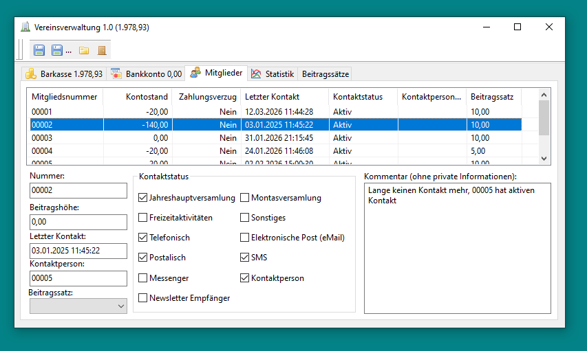
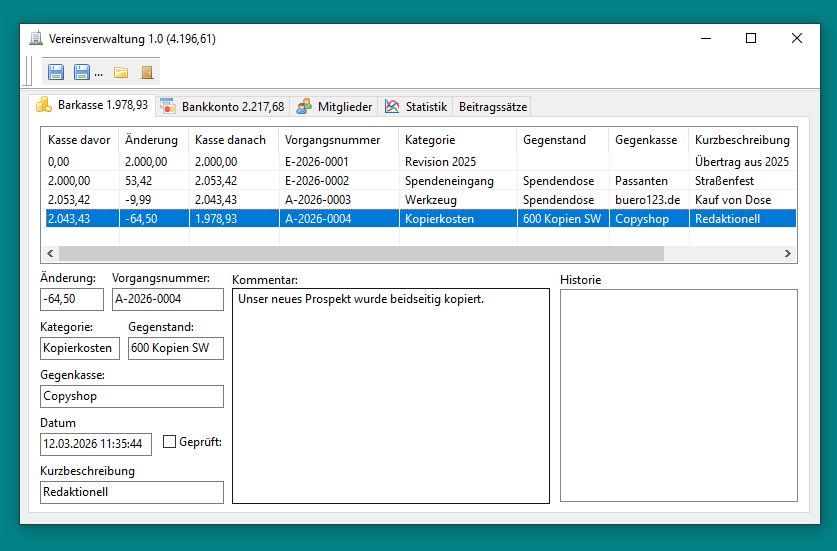
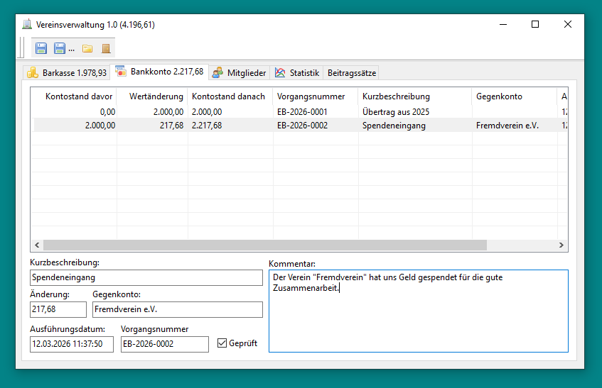

# Vereinsverwaltung
Ein Lazarus-Projekt für die Verwaltung von Vereinen

# Windows

[▼ Vereinsverwaltung.exe (Windows-Download)](https://github.com/enexusde/Vereinsverwaltung/releases/latest/)

# Linux

Unter Windows wird libsodium als eingebettete DLL mitgeliefert. Unter Linux
wird stattdessen die vom System bereitgestellte libsodium zur Laufzeit
nachgeladen, daher wird folgendes Laufzeit-Paket benötigt:

```sh
# Debian/Ubuntu
sudo apt install libsodium23

# Fedora
sudo dnf install libsodium

# Arch
sudo pacman -S libsodium
```

## Selbst bauen

Voraussetzungen: Lazarus/FPC (Paket `lazarus`) sowie `libsodium23`.

```sh
lazbuild Vereinsverwaltung.lpi
./Vereinsverwaltung
```

# Beispiel Mitglied



# Beispiel Barkasse




# Beispiel Konto




# Beispiel Statistik


